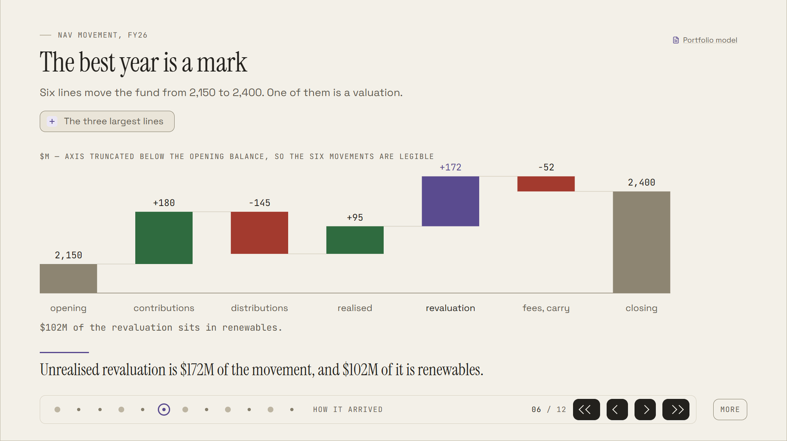
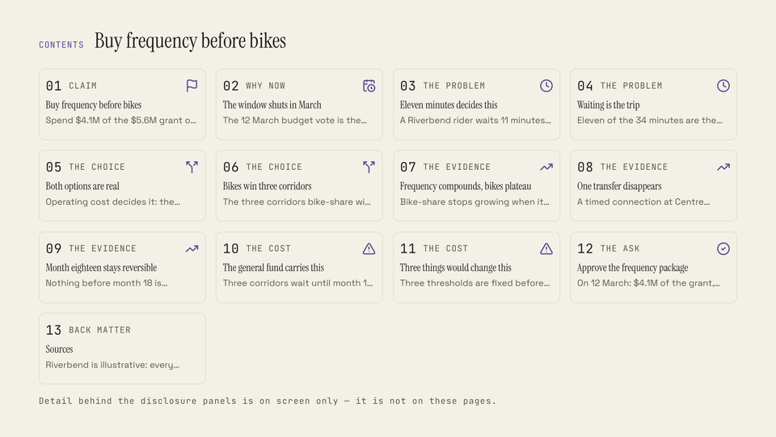
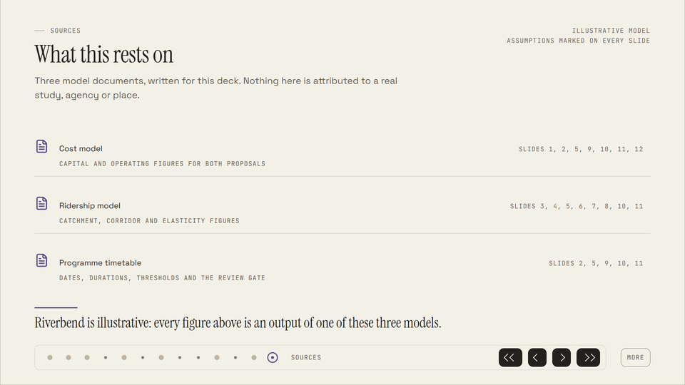

# htmldeck

**Presentations as a single HTML file that don't look generated.** A Claude Code plugin.

Ask Claude for a presentation and you get one `.html` file. It opens with a double-click and works
with the network off, because its fonts, icons and diagrams are inside it. The people you send it to
install nothing.

Most generated decks look generated, with walls of bullets and stock layouts. htmldeck builds each
deck from a written design system and checks the result against those rules. It can also review
any deck you give it, and it does not soften the verdict.



## Install

Type these inside Claude Code:

```
/plugin marketplace add uchimata2/htmldeck
/plugin install htmldeck@htmldeck
```

The deck checks need Python and Chrome or Edge. You don't install any packages.

## Features

- **One file that travels.** Email it, or open it on a projector laptop with no Wi-Fi. It looks the
  same wherever it opens.
- **Real diagrams and charts, not pictures of them.** They stay sharp at any size and follow the
  theme.
- **Detail on demand.** Each slide states its point. The supporting numbers sit behind a `+` panel
  that you open when someone asks.
- **Sources inside the deck.** A slide can cite a source document and open it in place.
- **A reading view.** Press `r` and the deck becomes one scrolling page with every panel open.
- **Speaker notes that stay private.** Notes go into a separate presenter file, never into the deck
  you share.
- **Light and dark, motion on or off, print.** Arrow keys move between slides, `d` opens detail,
  `t` switches theme and `f` goes fullscreen.
- **Two questions, then it builds.** How long should it be, and is there anything to align to: a
  brand, a deck, source documents? The design system settles the rest.
- **Specs you can read.** Each run writes the outline and a slide-by-slide spec beside the deck. It
  waits for your sign-off on both, unless you tell it to just build.
- **A check that admits what it skipped.** `check.py` tests a deck against the design system and
  names every rule it could not test, with the reason.
- **A blunt review.** Critique mode scores a deck, yours or anyone's, and tells you what to fix
  first.

<p>
  
  
</p>

## Usage

Ask in plain words:

> Make a board deck from `notes/board-review.md`, ten slides at most.

Claude asks its two questions and shows you the outline, then the slide-by-slide spec. Then it
builds the deck in batches. You end up with three files:

| File | What it holds |
| :--- | :--- |
| `board-review.html` | The deck |
| `board-review.foundation.md` | The governing idea and the outline |
| `board-review.slides.md` | What each slide says and shows |

To review a deck you already have:

> Critique `deck.html` against the sources in `notes/`.

From a clone, you can run the check on any deck. Every rule it owns ends up checked, excused with a
written reason, or failing, and the buckets have to add up:

```bash
python tools/deck/check.py examples/reference-deck.html
```

```
  owned by a gate      122
  checked               93
  failing                0
  excused in the rules   3   DS-072 DS-210 DS-211
  excused here          26
  undecided, no subject  0
  SILENT                 0
  ------------------------
  buckets sum to       122   = owned, so the account is a partition

0 failure(s): none
```

The review runs the same way, and lists what only a person can judge:

```bash
python tools/deck/critique.py <deck> --sources <dir>
```

## Examples

Download any of these and double-click. The cities, companies and figures in them are invented.

| Deck | What it shows |
| :--- | :--- |
| [`reference-deck.html`](examples/reference-deck.html) | A transit funding decision, built by hand against the design system: diagrams, a timeline, a network map |
| [`sort-window/`](examples/sort-window) | A parcel operations board deck, built by the plugin, with its specs and sources beside it |
| [`portfolio-review/`](examples/portfolio-review) | An investment committee review, built chart-first |
| [`measure-first/`](examples/measure-first) | A demand planning review, built by an outside user with the published plugin |

[`examples/README.md`](examples/README.md) lists what was measured on each deck.

## Upgrade

Run this in a terminal, then restart Claude Code:

```bash
claude plugin update htmldeck@htmldeck
```

`/plugin marketplace update` refreshes the catalog but leaves the installed plugin where it was. For
automatic updates, open `/plugin`, go to **Marketplaces**, select `htmldeck` and choose **Enable
auto-update**.

To bundle htmldeck inside your own plugin, copy `skills/`, `docs/`, `tools/`, `shell/`, `examples/`
and `themes/` together. The skill needs the rest to run.

## Learn more

| | |
| :--- | :--- |
| [`docs/DESIGN-SYSTEM.md`](docs/DESIGN-SYSTEM.md) | The rules every deck is built and checked against |
| [`docs/DESIGN-RATIONALE.md`](docs/DESIGN-RATIONALE.md) | Why each rule is what it is |
| [`docs/EVALUATION.md`](docs/EVALUATION.md) | How a deck is scored, and when it is good enough |
| [`skills/htmldeck/SKILL.md`](skills/htmldeck/SKILL.md) | What the plugin tells Claude to do |

## Licence

MIT, in [`LICENSE`](LICENSE). The embedded typefaces are under the SIL Open Font License 1.1. Each
deck carries that notice beside the fonts, so a deck you send is correctly licensed on its own.

Current version: 0.7.0.
