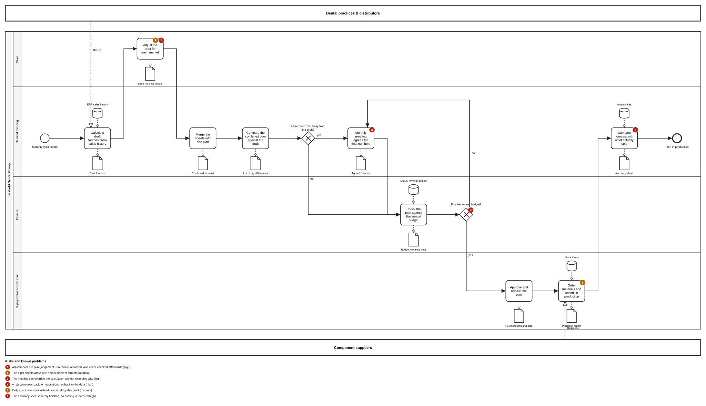

# Deliverable 1 — Current Business Process Analysis

**Client:** Larkfield Dental Group · **Process analysed:** Demand Planning
**Work package:** WP1
**Date:** 2026-08-05

---

## About the numbers

The Larkfield case is fictional. Every figure here is invented to be realistic and marked
`[example]`. Anything taken from the client scenario is marked `[case]`. No number here is a real
measurement.

---

## 1. The process we chose, and why

**We chose Demand Planning: deciding how much of each product to make and stock.**

One bad forecast explains several of the CEO's complaints at once. A forecast that is too high
builds up stock. One that is too low causes shortages, late deliveries and complaints. Too much
stock and too little stock sound like opposite problems, and they come from the same place. `[case]`

**We plan at product-family level** — the eight groups in Larkfield's catalogue: treatment units,
instruments, sterilization equipment, CAD/CAM components, implants, scanners, consumables, practice
supplies. Individual articles would not fit on one page.

### 1.0 Where this document sits

**An AI project runs along a chain of five steps, and it starts at the left.**

```
[ 1. Business goal ] → [ 2. Business question ] → [ 3. Data ] → [ 4. AI / ML ] → [ 5. Decision ]
```

The chain is the reason this engagement produces five documents instead of one, and the reason it
begins with a process rather than a technology. Each document is one part of it:

| Step | Where it is answered |
| :--- | :--- |
| **1. Business goal** | This document, §1 — cut delays, free the money in slow stock, stop the margin decline |
| **2. Business question** | This document, §3 and §5 — what do we need to measure that we do not measure now |
| **3. Data** | [D2](D2-predictive-analytics-assessment.md) — what we would need, and whether we have it |
| **4. AI / ML** | [D3](D3-future-business-process.md) — what the system predicts |
| **5. Decision** | [D3](D3-future-business-process.md) and [D5](D5-management-decision-matrix.md) — what somebody does on a Monday morning |

**Starting at step 4 is the common mistake.** A company buys a forecasting tool, then discovers the
data cannot support it and nobody agreed what "better" would mean. Larkfield's CEO asked the
question the right way round: what can Business Analytics do *before* we invest in AI. `[case]`

### 1.1 How the process works today

This table describes the process. The diagram in §1.2 is generated from it.

| # | Who | System | What they do | Input | Output |
| :-- | :--- | :--- | :--- | :--- | :--- |
| 1 | Demand Planning | ERP | Pull two years of sales history and calculate a first forecast from the average | Sales history | Draft forecast |
| 2 | Regional Sales Managers (8 markets) | CRM + Excel | Adjust the draft up or down for their own market | Draft forecast, own judgement | 8 regional sheets |
| 3 | Demand Planning | Excel | Merge the eight sheets into one plan | Regional sheets | Combined forecast |
| 4 | Demand Planning | Excel | Compare the combined plan against the draft | Draft + combined forecast | List of big differences |
| 5 | Demand Planning | — | **Decision:** more than 15% away from the draft? | List of big differences | Route: to the meeting, or straight to Finance |
| 6 | Sales, Demand Planning, Supply Chain | Meeting | Monthly meeting to argue out the differences and agree final numbers | Combined forecast, difference list | Agreed forecast |
| 7 | Finance | ERP | Check the agreed plan against the annual revenue budget | Agreed forecast, annual budget | Budget variance note |
| 8 | Finance | — | **Decision:** does it fit the budget? | Budget variance note | Route: approve, or back to the meeting |
| 9 | Head of Supply Chain | ERP | Approve and release the plan | Approved forecast | Released demand plan |
| 10 | Procurement & Production | ERP | Order materials and schedule production | Released plan, stock levels | Purchase orders, production schedule |
| 11 | Demand Planning | Excel | Compare last month's forecast with what actually sold | Actual sales, old forecast | Accuracy sheet — rarely finished |

**In BPMN a decision only routes the flow. It does no work.** That is why steps 5 and 8 have their
own rows, and why the step that feeds each one is separate: the comparison in step 4, the budget
check in step 7. One box saying "decide whether it fits the budget" would hide the work Finance
does in its own lane.

**Departments:** Sales · Demand Planning · Supply Chain / Procurement · Production · Finance
**Outside the company:** dental practices and distributors (demand), component suppliers (supply)

**The loop:** a plan rejected by Finance at step 8 goes back to the *meeting* at step 6. It does not
go back to the data at step 1. The forecast is renegotiated, not recalculated.

### 1.2 Process map



Files: [`diagrams/demand-planning-as-is.svg`](../diagrams/demand-planning-as-is.svg) ·
[`.bpmn`](../diagrams/demand-planning-as-is.bpmn) ·
[`.yaml`](../diagrams/demand-planning-as-is.yaml) (the source)

**The map has layers you can switch on and off.** Open the `.html` version and use the checkboxes.

| Layer | Shows | Default |
| :--- | :--- | :--- |
| Inputs & outputs | The data each step reads and produces: sales history, the draft forecast, purchase orders | on |
| Customers & suppliers | Dental practices and component suppliers, and the messages crossing the company boundary | on |
| **Risks & problems** | Numbered badges marking where the problems in §2 and §5 happen, with a legend | **off** |

The risk layer puts the six problems on the steps that cause them. The process and its weaknesses
can then be shown as one picture or as two.

**Reading the map:** the flow runs left to right and each horizontal band is a department. The
diamonds are decisions. The branch labelled *"no — renegotiate"* runs backwards above the flow. That
is the loop from Finance back to the meeting, and it is the shape of the core problem.

---

## 2. What goes wrong

### Where are the delays?

The eight regional sheets arrive late and in different formats, so nothing can be merged until the
slowest market replies. `[example]` The whole cycle takes about three weeks of every month. That
leaves roughly one week to order and produce anything. `[example]`

### Where do people decide on gut feeling instead of data?

**Step 2 is the main one.** Regional managers adjust the forecast from experience. Nobody writes
down why, and nobody checks afterwards whether they were right.

**Step 6 can change any number without a recorded reason.** The meeting minutes hold the new figure,
not the argument behind it.

### Which measurements already exist?

Revenue against budget, stock value, delivery punctuality (counted by hand), and the number of
customer complaints. All of them measure the *result*. None of them measures the *forecast*. See §3.

### What keeps happening again and again?

The expensive families — treatment units, CAD/CAM — are consistently over-forecast, and the cheap
everyday ones, consumables, consistently under-forecast. `[example]` So stock builds up where it
costs the most money and runs out where customers notice fastest. That is the CEO's contradiction,
and it has one cause. `[case]`

---

## 3. What is measured, and what is missing

| Measurement | What it tells you | Today |
| :--- | :--- | :--- |
| Revenue vs. budget | Are we hitting our sales targets | **Exists** |
| Stock value | How much money is tied up in the warehouse | **Exists** |
| Delivery punctuality | Share of orders arriving on time and complete. The industry term is **OTIF**, "on time, in full" | **Exists, but counted by hand and only "on time"** |
| Complaint numbers | How unhappy customers are | **Exists** |
| **Forecast accuracy** | How far the forecast missed, on average. The industry term is **MAPE**: the average percentage error across all products | **Missing** |
| **Forecast bias** | Whether we are *always* too high or *always* too low. Being wrong in both directions averages out. Being wrong in one direction does not | **Missing** |
| **Stockout rate** | How often a product was unavailable when someone wanted it | **Missing** |

**Larkfield measures its results carefully and its forecast not at all.** That is why the same
mistakes repeat every month.

---

## 4. Descriptive analytics — what happened

*Descriptive analytics answers "what happened?". It reports the past without explaining it.*

All figures `[example]`.

| Measure | Where it stands | What we see |
| :--- | :--- | :--- |
| Production output | 94% of the planned volume | Shortfalls come after a forecast was revised for budget reasons |
| Delivery punctuality | 87% of orders on time — counted by hand, and "in full" is not counted at all (§3) | Falling year on year; worst for consumables and instruments |
| Stock level and turnover | €18.6m in stock, sold and replaced 3.2× a year | Two slow families hold about 45% of the money, turning only 1.4× |
| Product defect rate | 2.3% of units shipped | Higher in months when production was rushed |
| Customer complaints | ~310 per quarter | 58% about delivery, 24% about quality — mostly a supply problem, not a product problem |
| Supplier reliability | 78% of orders arrive on time | Two suppliers cause more than half the delay |

**Three things stand out.**

1. **Too much stock and not enough stock, at the same time.** Nearly half the money sits in
   slow-moving families while the fast ones run out. The forecast decides that split.
2. **Complaints are about delivery, not the products.** Quality matters, but availability is what
   customers notice.
3. **Nothing above measures the forecast** — the one decision that causes most of it.

---

## 5. Diagnostic analytics — why it happened

*Diagnostic analytics answers "why did it happen?". It looks for the cause behind the numbers.*

### 5.1 Cause and effect

| Problem | Possible cause | Evidence available? | Data we would need | Priority |
| :--- | :--- | :---: | :--- | :---: |
| Too much slow-moving stock | Sales optimism on expensive families is never corrected (step 2) | Partly | Forecast vs. actual per family and per region, 2 years | **High** |
| Too much slow-moving stock | The monthly meeting overrides the calculation with no recorded reason (step 6) | No | Keep the original draft forecast alongside the agreed one | **High** |
| Shortages of fast movers | Everyday products get no analytical attention | Partly | How often each family was out of stock | **High** |
| Late deliveries | Supplier delays are absorbed by re-planning instead of being predicted | Partly | Supplier records: date promised vs. date delivered | **High** |
| Rising costs | Rush orders and express shipping to cover shortages | Partly | Express shipping cost charged to the family that caused it | Medium |
| Quality problems | Production rushed to catch up | No | A flag marking which batches were produced under time pressure | Medium |

### 5.2 What we can prove, and what we are only guessing

**We could prove this today, with data Larkfield already has:**

- The forecast is wrong in a *consistent direction* per product family, not just randomly wrong.
- A small number of suppliers cause most of the late deliveries.
- Most complaints are about delivery rather than product quality.

**These are still guesses, and we say so:**

- That the monthly meeting makes the forecast *worse*. It is the most valuable thing to test and it
  is impossible today: the calculated forecast is overwritten by the agreed one. Saving that one
  extra file would settle it.
- That express shipping is a big cost. Nobody tracks it separately.

### 5.3 The conclusion for management

**Larkfield does not have a forecasting software problem. It has a feedback problem.** The process
makes judgement calls it never checks, so it cannot learn from its own mistakes.

That is good news for the CEO's question. The first improvements need better measurement and better
discipline, not a large AI investment. They are also what makes a later AI project work. WP2
starts there.

### 5.4 Which of the five standard failure modes Larkfield has

**AI projects fail for data reasons, not algorithm reasons, and there are five usual ones.** We
checked Larkfield against all five rather than only reporting what we happened to find.

| Failure mode | Does Larkfield have it? | The evidence in this document |
| :--- | :--- | :--- |
| **Poor data quality** | **Partly** | Sales and stock come from invoices and are sound. Delivery punctuality is counted by hand, and eight markets submit eight layouts (§1.1) |
| **Missing data** | **Yes** | The two records that matter most are never kept: the draft forecast the calculation produced, and the reason for each adjustment (§5.2) |
| **Data silos** | **Yes** | The ERP holds the history, the CRM holds the customer view, and the actual planning happens in eight separate spreadsheets that talk to nothing (§1.1) |
| **No ownership** | **Yes — and this is the root one** | Nobody owns forecast quality. Adjustments are made every month, recorded nowhere, and checked by no one (§2, §5.2) |
| **Lack of governance** | **Yes, and it is invisible today** | There is no agreed definition of a "unit", no validation on the regional sheets, and no rule about what may be overwritten. The promised delivery date is overwritten when an order is rescheduled, destroying the record without anyone deciding to |

**Four and a half of the five.** That sounds alarming and is not, because the two that matter most
here — no ownership and missing data — are habits rather than systems. Larkfield is not missing
technology. It is missing the rule that says who is accountable for a number and what may not be
thrown away.

**Governance is the one nobody is asking for.** The other four show up as visible pain: late
deliveries, arguments in the monthly meeting, stock in the wrong place. Governance shows up as
nothing at all, right up to the moment somebody asks why two reports disagree. It is cheap to fix
now and expensive to retrofit after a model is running on the data.

---

## Terms used here

| Term | Plain meaning |
| :--- | :--- |
| **Demand planning** | Deciding how much of each product to make and keep in stock |
| **ERP** | The company's central business system, holding orders, stock and production data |
| **OTIF** | "On time, in full" — the share of orders that arrive when promised *and* complete |
| **MAPE** | Forecast accuracy: the average percentage by which forecasts miss reality |
| **Forecast bias** | Being wrong in a consistent direction: always too high, or always too low |
| **Descriptive analytics** | Reporting what happened |
| **Diagnostic analytics** | Finding out why it happened |

---

## 6. Check against the requirements

| Requirement | Status |
| :--- | :--- |
| Process chosen, with a reason linked to the CEO's question | ✅ §1 |
| As-Is process map | ✅ §1.2 — generated from §1.1; visual check passed 2026-08-05 |
| Step table with the five required columns | ✅ §1.1 |
| Existing and required measurements | ✅ §3 |
| The four investigative questions answered | ✅ §2 |
| Descriptive analytics results | ✅ §4 |
| Diagnostic analytics and cause-and-effect table | ✅ §5.1 |
| Likely causes separated from guesses | ✅ §5.2 |
| Every figure marked as example or from the case | ✅ throughout |
| The AI value chain named, with the home of each of its five steps | ✅ §1.0 |
| Checked against all five standard failure modes, not only the ones we found | ✅ §5.4 — four and a half of five |
