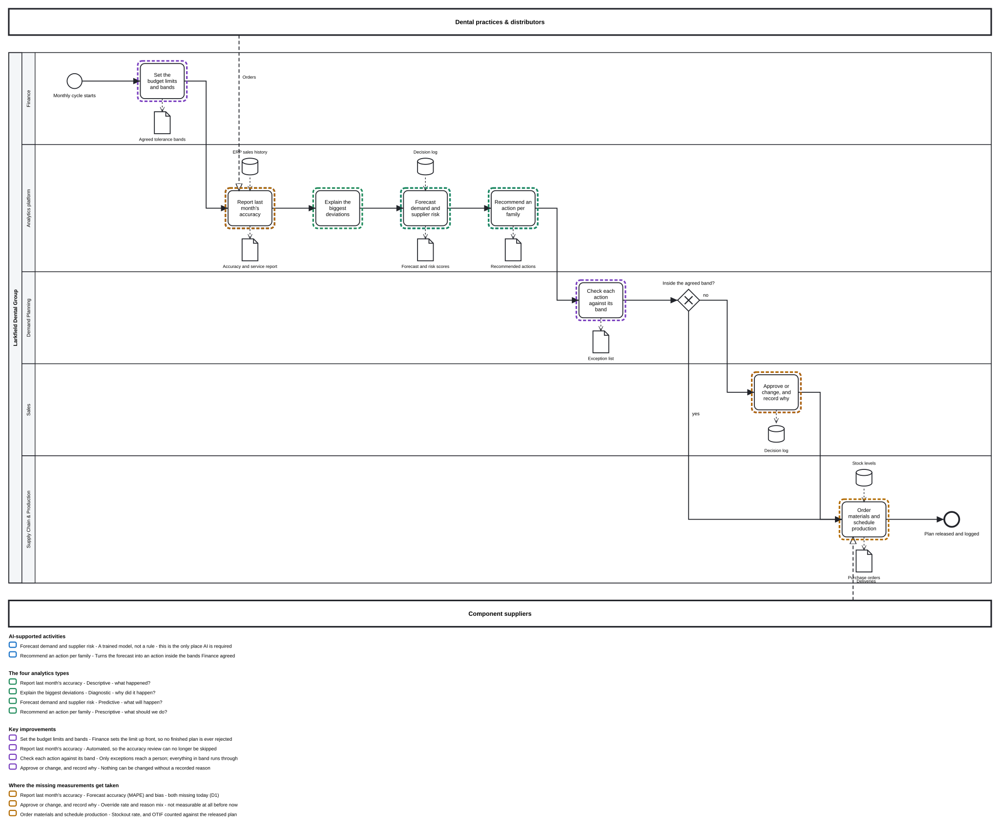

# Deliverable 3 — Future Business Process

**Client:** Larkfield Dental Group · **Process redesigned:** Demand Planning
**Work package:** WP3
**Date:** 2026-08-05

---

## About this document

The Larkfield case is fictional. Every figure here is invented to be realistic and marked
`[example]`. Figures taken from [D1](D1-current-business-process-analysis.md) and
[D2](D2-predictive-analytics-assessment.md) are marked `[D1]` or `[D2]` and are reused unchanged.
The three documents agree with each other.

These are worked examples, not a full inventory. Each section shows the few items that matter most.

### The rule the whole design rests on

**Analytics recommends. A person approves.** `[D-004]`

Two reasons, and the second is the stronger one:

1. The data is only partially ready. Two of six readiness items are red. `[D2 §5]` Automatic
   decisions taken on undocumented and unrepresentative data cannot be defended to the Board.
2. D1 found a feedback problem. Judgement is used every month and never recorded, so the process
   cannot learn from itself. `[D1 §5.3]` The approval step is where the reason finally gets
   written down.

The redesign keeps human judgement in demand planning. It makes that judgement visible, and
therefore measurable. Larkfield has never had that.

---

## 1. From prediction to action

*Prescriptive analytics answers "what should we do?". It turns an estimate about the future into a
named action with an owner.*

D2 named three predictions worth building. `[D2 §1]` Each one becomes an action a department can
take on a Monday morning.

| What the system predicts | What it recommends | Runs on its own? | Who acts |
| :--- | :--- | :--- | :--- |
| **Implants will sell 18% above last year's Q3** `[example]` (P1) | Raise the production plan and the component order for that family. Place the order a week earlier to cover the supplier lead time | **Yes**, up to **10%** of the current plan and with standard components. Above that, a person approves `[example]` | Procurement & Production |
| **Treatment units will sell 12% below plan** `[example]` (P1) | Cut the next replenishment for that family and release the committed budget | **No, never automatic.** Cutting production is slow to undo, and this is the family where D1 found sales optimism `[D1 §2]` | Demand Planning |
| **Supplier B: 72% chance of delivering late next month** `[example]` (P2) | Bring the order forward or split it with the approved second source. Raise safety stock for that month on the families it feeds | **Yes**, below **€25,000** order value and where a second source exists. Above either line, a person approves `[example]` | Supply Chain & Procurement |
| **The agreed forecast for consumables has run 9% under actual sales for five months** `[example]` (P3) | Flag the family in the monthly meeting and correct the *starting* draft, not only this month's number | **No.** This is advice to a meeting, never an instruction to a system | Demand Planning |

### Two tests decide whether the system may act alone

Both must pass.

1. **Is the action easy to undo?** Extra stock sells next quarter. A cancelled production slot is
   gone, and the changeover has been paid for.
2. **Is it inside the agreed band?** The bands are 10% of the plan and €25,000 of order value.
   They are narrow at the start and widen as the forecasts earn trust.

Row two shows why size alone is not enough. A 12% cut is a small number and still goes to a person.
It is hard to reverse, and it lands on the family where D1 showed judgement is already optimistic.

### The fourth row cannot be built yet

P3 is impossible with today's data. `[D2 §1]` Measuring whether the agreed forecast runs high or
low needs both numbers: the draft the calculation produced, and the figure the meeting agreed.
Today the second overwrites the first. `[D1 §5.2]`

The row stays in the table because the missing capability is a saved file, not a model. From the
first month Larkfield keeps both numbers, the row becomes buildable. It is also the row that
answers whether the monthly meeting improves the forecast or damages it.

### One thing is recorded every time: the reason

- When the system acts alone, it records which prediction and which band it acted under.
- When a person approves or changes a number, they pick a reason code. It is stored with the number.
  The codes are *promotion*, *tender*, *known supplier issue* and *disagree with the model*.

This single change closes the broken loop. Today a regional manager adjusts a forecast and the
reason stays in their head. `[D1 §2]` With a reason code attached, the company can ask after four
quarters which reasons turned out to be right. That question cannot be answered today.

---

## 2. The redesigned process



Files: [`diagrams/demand-planning-to-be.svg`](../diagrams/demand-planning-to-be.svg) ·
[`.bpmn`](../diagrams/demand-planning-to-be.bpmn) ·
[`.yaml`](../diagrams/demand-planning-to-be.yaml) (the source)

**The new map has eleven elements. The old one had thirteen.** `[D1 §1.2]` The redesign removes
three steps of spreadsheet work and one whole decision loop. Adding analytics normally makes a
process bigger; here it makes it smaller.

**The map has layers you can switch on and off.** Open the `.html` version and use the checkboxes.
It also has a text-size slider, for reading the map at the size it will have in the deck.

| Layer | Shows | Default |
| :--- | :--- | :--- |
| Inputs & outputs | The data each step reads and produces | on |
| Customers & suppliers | Dental practices and component suppliers | on |
| **The four analytics types** | Which type each analytics step is, and the question it answers | **off** |
| **AI-supported activities** | The steps that need a trained model | **off** |
| **Key improvements** | The four steps that fix a named problem from D1 | **off** |
| **Where the missing measurements get taken** | The three measurements D1 found missing, on the steps that now produce them | **off** |

### Only two of the eight steps need AI

They are *Forecast demand and supplier risk* and *Recommend an action per family*. Reporting last
month's accuracy and explaining a deviation are automation. The other four steps are people doing
their jobs with better information: setting the bands, screening, approving and ordering.

**This answers the CEO's question.** He asked how Business Analytics could improve a core process
*before* investing in Artificial Intelligence. `[case]` Six of the eight steps improve with no AI
at all. The two that need it become trustworthy only after the other six run. Those six
produce the recorded data a model would learn from.

### Where the four analytics types sit

They are four consecutive steps in the **Analytics platform** lane, in the order the questions are
asked.

| Step on the map | Analytics type | The question it answers |
| :--- | :--- | :--- |
| Report last month's accuracy | **Descriptive** | What happened? |
| Explain the biggest deviations | **Diagnostic** | Why did it happen? |
| Forecast demand and supplier risk | **Predictive** | What will happen? |
| Recommend an action per family | **Prescriptive** | What should we do? |

The lane makes the split visible. Everything inside it is done by a system. Everything outside it is
done by a person.

### The three changes that matter

**1. Three steps become one, and a fourth changes shape.** The As-Is calculated a draft, waited for
eight regional spreadsheets, merged them, then compared the merge against the draft. That took most
of the month. `[D1 §1.1]` The calculation, the merge and the comparison collapse into the analytics
pass, which does the same work and produces a recommendation. The regional adjustment does not
disappear — it becomes the exception review in §5. The eight spreadsheets are gone.

**2. Finance moves from the end to the start.** In the As-Is, Finance checked a finished plan
against the budget and could send it back to the *meeting* rather than to the data. The forecast
was renegotiated instead of recalculated. `[D1 §1.1]` Finance now sets the budget limits up front,
as the tolerance bands in §1. There is no rejection loop at the end.

**3. The feedback loop closes through the data.** The store named **Decision log** is written by
*Approve or change, and record why*, and read by *Forecast demand and supplier risk*. It is one
store drawn at two points on the map. The reason a person gives this month is an input to next
month's forecast. The As-Is had no such connection, and that is what D1 meant by a feedback
problem. `[D1 §5.3]`

### The six problems from D1, answered honestly

| What D1 found | Is it fixed? |
| :--- | :--- |
| Regional adjustments are pure judgement, with no reason recorded and no check afterwards | **Yes.** A change cannot be saved without a reason code, and the log feeds the forecast |
| The eight regional sheets arrive late and in different formats | **Yes, removed.** There are no regional sheets. Sales sees only the exceptions |
| The monthly meeting can override the calculation without recording why | **Mostly.** The meeting can still take place, but it can no longer set the number. Approval happens in the system, by a named owner, with a reason |
| A budget rejection goes back to negotiation, not back to the data | **Yes, designed out.** Finance's limit is now the band, applied before the plan is built |
| Only about a week of lead time is left when ordering starts | **Partly.** About two weeks of spreadsheet work disappear `[example]`, so ordering starts earlier. Supplier lead times themselves are unchanged, which is a WP4 question |
| The accuracy sheet is rarely finished, so nothing is learned | **Yes.** It is now the automated first step of every cycle |

Four of the six are closed, one mostly, one partly. The two that are not closed are named here
rather than hidden. A redesign claiming six out of six would not be credible.

---

## 3. The four types of analytics, side by side

Each row below is also a step on the map in §2. The table and the map describe the same four boxes.

| Type | The question it answers | What it gives Larkfield | Example from Demand Planning |
| :--- | :--- | :--- | :--- |
| **Descriptive** | *What happened?* | A shared baseline. You cannot improve a number nobody counts | Delivery punctuality held at **87%** and **€18.6m** sat in stock, turning 3.2× a year. `[D1 §4]` The forecast itself was never scored `[D1 §3]` |
| **Diagnostic** | *Why did it happen?* | The cause behind the symptom, so effort lands in the right place | **Two suppliers cause more than half the late deliveries.** `[D1 §4]` The forecast error has a direction: expensive families too high, consumables too low `[D1 §2]` |
| **Predictive** | *What will happen?* | Time. A problem seen a month early is cheaper than one seen on the day | Implants **18% above** last year's Q3. Supplier B at a **72% chance** of delivering late next month `[example, §1]` |
| **Prescriptive** | *What should we do?* | A named action with an owner. This is where the value is realised | Bring Supplier B's order forward or split it with the second source, and raise safety stock for that month. Automatic below **€25,000** `[example, §1]` |

The four types build on each other. Each one answers the question the type before it leaves open.
Descriptive analytics without diagnostic produces reports nobody acts on. Prescriptive analytics
without descriptive produces confident instructions nobody can check.

---

## 4. Three questions, answered from Larkfield's evidence

### Why are all four types necessary?

**Larkfield already uses all four types today, verbally and from memory.** Somebody reads last
month's numbers, somebody explains the deviation in the meeting, somebody predicts next quarter
when they adjust their region, and somebody decides what to order. `[D1 §1.1]`

What is missing is the record between them. The answers are spoken, so nothing carries from one
question to the next and nothing can be checked later. Skipping a type does not remove its
question. It only means the answer comes from experience instead of evidence.

### Could predictive analytics work without descriptive?

**No.** A forecast model can be built without descriptive analytics, but it cannot be scored, and an
unscored forecast cannot be trusted.

Larkfield does not measure forecast accuracy or forecast bias at all. `[D1 §3]` Without those two
numbers, nobody can say whether a model beats the spreadsheet it replaced, or notice when it starts
to drift. Descriptive history is also the material a model learns from.

This is why *Report last month's accuracy* is now the **first** step of every cycle. In the As-Is it
was step 11 of 11, and D1 found it was rarely finished because the month ran out first. `[D1 §1.1]`

### Could prescriptive analytics work without reliable predictions?

**Yes, and that is the danger.** A prescriptive layer does not stop when the forecast under it is
weak. It keeps issuing specific instructions, faster than anyone can review them.

**Bad data does not stay a data problem. It travels:**

```
[ Poor data ] → [ Poor prediction ] → [ Poor decision ] → [ Business loss ]
```

Each arrow is cheap to cross and expensive to cross back. At the first box the problem is a
spreadsheet nobody validated. At the last it is stock in the wrong warehouse and a practice that
ordered elsewhere. Larkfield is living the end of this chain today — the €18.6m of stock and the
87% delivery punctuality `[D1 §4]` are the *fourth* box, and D1 traced them back to the first.

**Automation shortens the chain; it does not change it.** That is the whole argument for the design
in §1: the faster the chain runs, the more it matters where a person stands in it.

The data is partially ready, with two of six readiness items red. `[D2 §5]` The item that matters
most here is **bias**. A missing value or a duplicate is visible; bias is not. The data looks clean
while being wrong in one consistent direction. `[D2 §4]` Automation on top of biased data repeats
the error at machine speed.

Waiting for reliable predictions is not the answer, because that moment never quite arrives. The
answer is the design in §1: **the system acts only where the action is small and easy to undo, and
everything else goes to a person.** `[D-004]`

---

## 5. What changes for the people doing the work

A process map shows steps moving. It does not show that people's jobs change shape.

| Who | What they stop doing | What they start doing |
| :--- | :--- | :--- |
| **Regional sales managers** (8 markets) | Filling in a spreadsheet for a whole market every month. The eight regional sheets no longer exist `[D1 §1.1]` | Reviewing only the exceptions: the families where the recommendation falls outside the band. They pick a reason code whenever they change one |
| **The demand planner** | Calculating the draft by hand, chasing the slowest market, merging eight sheets, and running out of month before the accuracy sheet is done | Owning the screening step and the quality of the decision log. The work moves from assembling numbers to managing exceptions |
| **Finance** | Reviewing a finished plan at the end of the cycle and sending it back `[D1 §1.1]` | Setting the budget limits and the bands up front, once per cycle. The same authority, three weeks earlier, with no rejection loop |
| **Supply Chain & Procurement** | Absorbing supplier delays by re-planning after they happen `[D1 §5.1]` | Acting on a supplier risk figure before the delay, with about two weeks more lead time `[example]` |

### The regional managers will resist this, and the reason is fair

For them the redesign is less work and more exposure. Their judgement is private today: an
adjustment is made, the reason stays in their head, and nobody checks whether it was right.
`[D1 §2]` From now on the reason sits next to the number and can be scored next quarter.

This is the most valuable change in the redesign and the one most likely to fail. It works only if
the reason codes are used to find out **which kinds of reasoning turn out to be right**, not to rank
eight managers against each other. The first time the log is used to make a performance point, it
fills with whichever code is safest. The data then becomes worthless. The safeguard is in
[D4 §3](D4-implementation-concept.md).

### Nobody has to become a data scientist

None of the four roles above operates a model. Only two of the eight steps need AI, and both sit
inside the analytics platform. The organisation is asked to change habits: record the reason, work
the exceptions, set the limits early.

---

## What management should do next

Three actions, in order. Benefit figures and phasing belong to WP4.

1. **Start keeping the two missing records this month.** The draft forecast, saved next to the
   agreed one, and a reason code on every adjustment. `[D2 §6]` No system and no licence are
   needed. Until they exist, the accuracy question cannot be answered.
2. **Have Finance set the first bands before anything is automated.** The bands carry the decision
   rule of the whole design (§1). Set them narrow, agree what evidence would justify widening them,
   and review them each quarter.
3. **Pilot on the strongest data, not across the portfolio.** D2's verdict was *partially ready*:
   sound sales and stock history, unreliable everything else. `[D2 §5]` Run the new cycle on a few
   families where the history holds up. Collect the missing records for the rest in parallel.

---

## Terms used here

| Term | Plain meaning |
| :--- | :--- |
| **Prescriptive analytics** | Turning an estimate about the future into a named action with an owner |
| **Tolerance band** | An agreed limit, in percent or euros. Inside it the system may act alone; outside it a person must approve |
| **Reason code** | A short fixed label chosen when a number is changed: *promotion*, *tender*, *known supplier issue*, *disagree with the model* |
| **Decision log** | The record of approvals and their reasons. Written by the approval step, read by next month's forecast |
| **Data store** *(on the map)* | Something the process reads from and writes to. It is drawn at each point it is used, so one store can appear twice |
| **Forecast accuracy** | How far the forecast missed, on average. The industry term is **MAPE** `[D1]` |
| **Forecast bias** | Being wrong in one consistent direction: always too high, or always too low `[D1]` |
| **Safety stock** | A buffer held on purpose, to absorb a late delivery or a demand spike |
| **Second source** | An alternative approved supplier for the same component |

---

## Check against the requirements

| Requirement | Status |
| :--- | :--- |
| To-Be process map | ✅ §2 — generated from the YAML spec; visual check passed 2026-08-05 |
| All four analytics types integrated end to end, visible on the map | ✅ §2 — four consecutive steps in the Analytics platform lane, plus the switchable layer |
| Prescriptive action table: prediction → action → owner | ✅ §1 — four rows, with a tolerance band column carrying `[D-004]` |
| Where the human decision point remains | ✅ §1 and §2 — the band gateway, the approval step, and the reason flowing back to the data |
| Comparison matrix of the four analytics types, with a Larkfield example per row | ✅ §3 — all four rows, each tied to a step on the map |
| The three discussion questions answered | ✅ §4 — answered from D1 and D2's findings |
| What changes for the people doing the work | ✅ §5 — four roles, plus the resistance the change will meet |
| Actionable management recommendations | ✅ *What management should do next* |
| Consistent with D1 and D2; every figure marked `[example]`, `[case]`, `[D1]` or `[D2]` | ✅ throughout |
| Business value quantification and roadmap | ⬜ Out of scope by design — WP4 |
